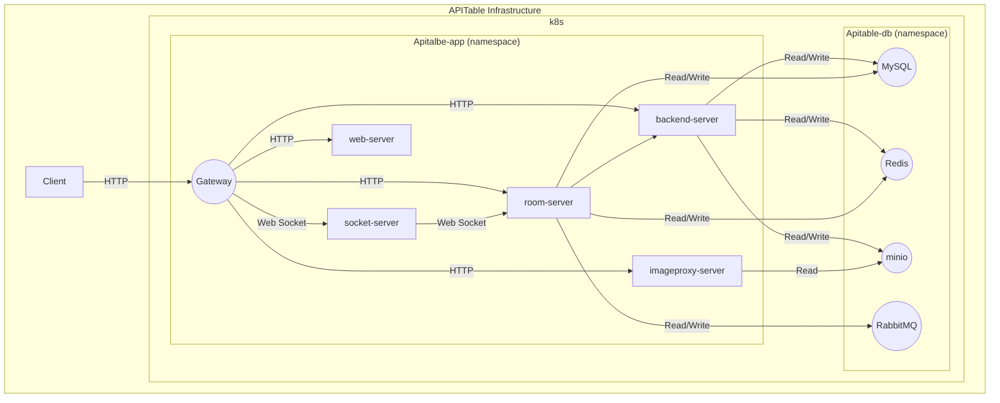

## This example creates an apitable from the built-in  `datacenter` and `app` modules

## Configration
1. Replace the kubeconfig certificate to `config-k8s/kubeconfig` with the appropriate one.
2. Replace `namespace`, `env`, `default_storage_class_name` and other configurations according to the annotation instructions
3. Replace all the `regcred` informations .

## Useage
To run this example you need to execute:
```
$ terraform init
$ terraform plan
$ terraform apply
```
Run `terraform destroy` when you don't need these resources.


### Instructions

